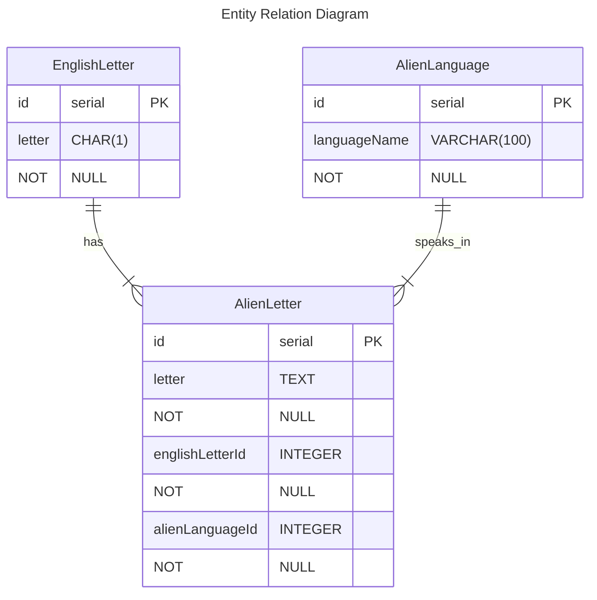

```mermaid
---
title: Entity Relation Diagram
---
erDiagram
    EnglishLetter {
        id serial PK
        letter CHAR(1) NOT NULL
    }

    AlienLanguage {
        id serial PK
        languageName VARCHAR(100) NOT NULL
    }

    AlienLetter {
        id serial PK
        letter TEXT NOT NULL
        englishLetterId INTEGER NOT NULL
        alienLanguageId INTEGER NOT NULL
    }

    EnglishLetter ||--|{ AlienLetter: has
    AlienLanguage ||--|{ AlienLetter: speaks_in

```